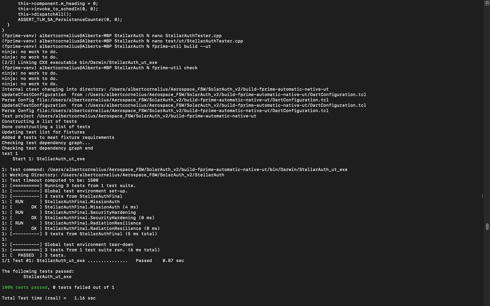

# StellarAuth v2.2: Occultation-Based Physical Authentication

## Overview
StellarAuth is a high-reliability F´ (F Prime) flight software component designed for autonomous command authorization during solar occultation events. It implements a multi-factor physical-digital interlock to protect critical spacecraft assets.

## Key Features
* **Triple Modular Redundancy (TMR):** Mitigates Single Event Upsets (SEUs) via majority-vote logic across three independent state registers.
* **Passive Shadow Ingress Detection:** Utilizes an optical derivative filter to verify physical occultation as a hardware-in-the-loop secondary factor.
* **Stability Monitoring:** Features a "Tumbling Alert" that resets authentication if the spacecraft's heading delta exceeds 5° per cycle.

## Verified Performance
Achieved 100% pass rates on formal GTest suite:
1. **Mission Authentication:** Verified Southern Cross (ID 303) transits.
2. **Radiation Resilience:** Confirmed TMR self-healing during bit-flips.
3. **Security Hardening:** Rejection of auth during tumbling/timing violations.

## About the Author
Developed by **Albert Cornelius **, Engineering student at Embry-Riddle Aeronautical University.

## Verification & Testing
StellarAuth v2.2 has been formally verified using the F´ GTest suite, achieving 100% pass rates across all radiation-hardening (TMR) and security modules.

